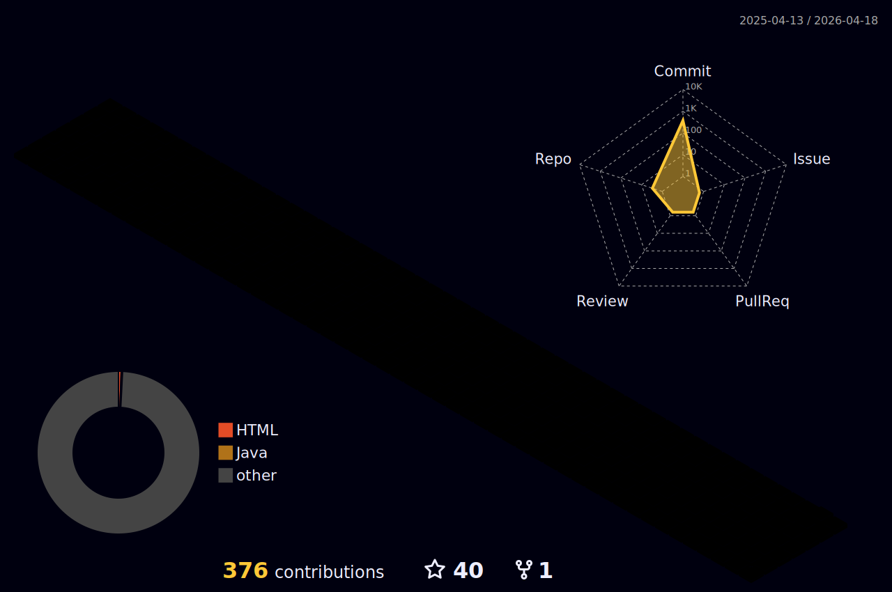

<!--------------------------------------------------------- Animated text --------------------------------------------------------->
 

<!--------------------------------------------------------- Waves and Rainbow gif--------------------------------------------------------->

 

  
 

<!--------------------------------------------------------- Profile visitors counter --------------------------------------------------------->

 
   

 

<!--------------------------------------------------------- About me section  --------------------------------------------------------->
<h2>
  About Me 
  
</h2>
<!-- Introduction gif -->

  

<!-- About -->

- 🔭 I’m currently working on **My-personal-project**

- 🌱 I’m currently learning **reactJS**

- 👯 I’m looking to collaborate on **Web development based projects**

- 🤝 I’m looking for help with **how to contributing more..**

- 👨‍💻 All of my projects are available at [https://rohit4100.github.io/portfolio/](https://rohit4100.github.io/portfolio/)

- 📝 I regularly read articles on [hashnode](hashnode)

- 💬 Ask me about **Computer Networking💻**

- 📫 How to reach me **rohitudamale777@gmail.com**

- ⚡ Fun fact **People are watching u don't let them die with boredom👀**

 

<!--------------------------------------------------------- Contact with me section --------------------------------------------------------->
<section align="center">
  <h2 align="center">Contact With Me 
    
  </h2>
  

    
    
    
    
    
    
  

<!--------------------------------------------------------- Languages and tools section --------------------------------------------------------->
  <h2 align="center">Languages And Tools 
    
  </h2>
  
 
                 
  

   

<!--------------------------------------------------------- Stats section --------------------------------------------------------->
  

    <h2 align="center">Stats 
      
    </h2>
  
    &nbsp; &nbsp; 
  

  
  
  

 
<!--------------------------------------------------------- Contribution Section --------------------------------------------------------->
  <h2>Contribution 
    
  <h2/>
  

    
  

  <!-- 3D Animation graph -->
 

  
   
  

<!--------------------------------------------------------- Pinned section --------------------------------------------------------->
   <h2>Pinned 
    
  <h2/>
<!-- Pinned repositories -->
  

    
    &nbsp;
     
  
 
  

    
    &nbsp;
     
  

  

     
   &nbsp;
     
  

   
  

    
  

<section/>
